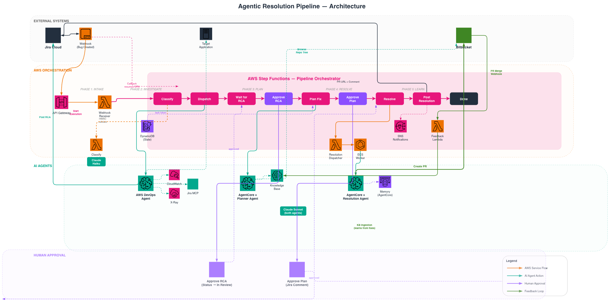

# Agentic Resolution Pipeline

End-to-end AI-driven engineering resolution: bug ticket in, pull request out.

## What this is

A reference architecture for autonomous incident and bug resolution using AI agents on AWS. The pipeline receives bug reports from Jira, investigates using AWS observability tools, plans and executes code fixes, and opens PRs for human review.

Currently integrated with **Jira** for intake. The architecture is extensible to other ITSM systems (ServiceNow, Freshdesk, PagerDuty) via the normalized event schema — additional connectors can be added under `intake/`.

## Architecture



## How it works

```
Bug Ticket → Classify → Investigate → Plan → Fix → PR → Learn
```

| Phase | What happens | Powered by |
|-------|-------------|------------|
| **Trigger** | Jira webhook fires, event normalized, Step Functions execution starts | API Gateway, Lambda |
| **Classification** | Rules + LLM classify ticket type (BUG, INCIDENT, NOISE, etc.) | Lambda, Claude Haiku |
| **Investigation** | DevOps Agent queries CloudWatch, X-Ray, Jira MCP; posts RCA findings | AWS DevOps Agent |
| **Approval** | Human reviews RCA, transitions ticket to "In Review" | Jira workflow |
| **Planning** | Bedrock Agent queries KB for similar past fixes, resolves repo, builds strategy | Bedrock Agent, Knowledge Base |
| **Approval** | Human reviews plan, comments `/approve-plan` | Jira comment |
| **Resolution** | Strands Agent clones repo, writes fix + tests, creates PR | AgentCore Runtime, ECS Worker |
| **Post-Resolution** | Posts PR URL to Jira, sends email notification | Lambda, SNS |
| **Feedback** | On PR merge, resolution doc ingested into KB for future queries | Lambda, Bedrock KB |

## Directory structure

```
├── intake/                     # Event ingestion connectors
│   ├── jira/                   #   Jira MCP server + webhook receiver
│   └── bitbucket/              #   PR merge handler (KB ingestion trigger)
├── orchestrator/               # Step Functions state machine + Lambda handlers
│   ├── state_machine.asl.json  #   Pipeline flow definition
│   ├── handler.py              #   All orchestrator Lambda handlers
│   ├── classifier.py           #   Rules-based classification
│   ├── llm_classifier.py       #   LLM fallback for ambiguous tickets
│   ├── resolution_planner.py   #   Bedrock Agent invocation
│   └── repo-config.yaml        #   Jira project → repo mapping
├── resolution/                 # Resolution Agent
│   ├── agentcore/              #   Strands agent container (AgentCore Runtime)
│   └── worker/                 #   ECS Worker (drives AgentCore, sends callbacks)
├── infrastructure/             # CDK stacks (7 stacks)
├── sample-app/                 # IoT Fleet Management demo app (4 services, 5 bugs)
├── skills/                     # DevOps Agent skill definitions
└── docs/                       # ADRs, deployment guide, architecture diagrams
```

## Sample Application

Includes a realistic **IoT Fleet Management** app (4 polyglot microservices on ECS Fargate) with 5 planted cross-service bugs for E2E testing. See [`sample-app/iot-fleet-management/README.md`](sample-app/iot-fleet-management/README.md).

## Quick start

See [`docs/DEPLOYMENT_GUIDE.md`](docs/DEPLOYMENT_GUIDE.md) for full deployment instructions.

```bash
# Prerequisites: AWS account, Docker, CDK bootstrapped, Jira Cloud tenant

# Deploy pipeline infrastructure
cd infrastructure
cdk deploy -c vpc_id=<your-vpc-id> --all

# Deploy sample app (optional)
cd sample-app/iot-fleet-management/infrastructure
cdk deploy -c vpc_id=<your-vpc-id>
```

## Architecture

See [`docs/PIPELINE_FLOW.md`](docs/PIPELINE_FLOW.md) for the detailed flow diagram, or open [`docs/architecture-pipeline.drawio`](docs/architecture-pipeline.drawio) in [diagrams.net](https://app.diagrams.net).

## Key design decisions

See [`docs/ADR.md`](docs/ADR.md) for the full decision record. Highlights:

- **ECS Worker for unlimited execution** — Resolution Agent runs via an ECS Fargate task (no Lambda 15-min timeout)
- **Step Functions Task Token callback** — async pattern allows hours-long agent execution
- **AgentCore Memory** — agent learns from past resolutions (semantic + preferences + summaries)
- **S3 payload handoff** — large planner outputs passed via S3 (ECS overrides limited to 8KB)
- **Knowledge Base feedback loop** — merged PRs are ingested for future planning queries

## Architecture principles

1. **Agent-per-phase** — each phase uses a specialized agent optimized for that task
2. **Never auto-merge** — PRs always require human review before merge
3. **Human-in-the-loop** — two explicit approval gates (post-RCA and post-plan)
4. **Knowledge feedback** — every merged fix feeds back into the KB for smarter future resolutions
5. **Observable** — full logging at every step (CloudWatch, worker logs, AgentCore traces)
6. **Extensible** — add new ITSM connectors, repo providers, or investigation tools without changing the core pipeline
